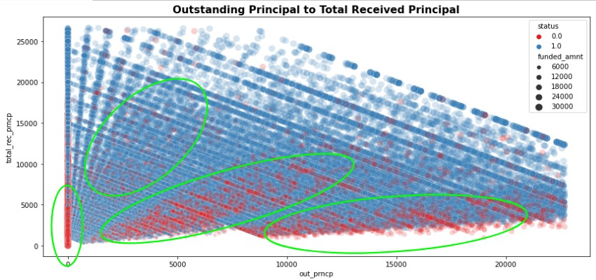

# About the project
The "Predicting Loan Status and Credit Risk" project aims to leverage advanced machine learning techniques to assist financial institutions in evaluating loan applicants' creditworthiness accurately. By predicting loan status and assessing credit risk, this project will enable lenders to make more informed lending decisions, reduce the likelihood of defaults, and optimize their lending portfolios.

# Objective
- Produce machine learning classifier to predict positive and negative loan.
- Provide business recommendation.

# Research Question
 - What factor affect borrowers loan status?
 - Does delinquency matters to loan status?

 # Hypotesis
 - There is various factor affect loan status, funded amount may affect loan status consider with purpose of the loan.
 - Delinquency represent borrowers behavior to loan have possibility to affect loan.

 # Data
 Data were loan data from 2007 to 2014

 # EDA
 In this part we explore data to know the distribution of each feature then find relation on specific target (loan status).

 ## Univariate Analysis

Some categorical data have high cardinality and there is a constant columns need to droped. Loan_status is target label and have some category, this feature will simplified to positive and negative borrowers. Pymnt_plan have extreme difference on the category distribution and more likely a constant, this feature will be dropped.

Numerical columns have vary distribution and will be process further for transformation. Policy_code is a constant and need to drop.

## Multivariate Analysis

Loan status have significant difference for each feature

Recoveries and collection_recovery_fee have extreme difference that may lead to leak data in model, this feature will be dropped. Some feature have outliers that will process in data prerocessing

# Data Preprocessing
Features with high cardinality, constant, leak data, and missing values > 20% were dropped in this step. Feature with missing values <20 % were impute with some method : Zero fill, Mode fill, Median fill. Outliers handling with zscore applied to feature with > 1% outliers.
Data Transformation :
- Label encoding applied to categorical feature with 2 unique values and ordered features.
- One Hot encoding applied to categoricals with nominal feature.
- Log transformation applied to numerical continuous features with high value.
- Normalization scaling, applied to all feature after transformation above.

Train test split with train size 70%. Train data were have imbalance target and handled with SMOTE oversampling to avoid overfit on model

# Machine Learning Modeling
In this step we trial 5 classifier model and use model metrics accuracy, precision, recall and f1 score to evaluate the models.Model were evaluates with cross validation with 5 folds cv. The best model result from this trial is XGB Classifier that have highest accuracy and precision.

We pick  XGB Classifier to have hyperparameter tuning, with parameter max_depth and n_estimators.

Model after hyperparameter tuning were improved on accuracy and precision. Accuracy was improved by 0.0002 and precision by 0.001.

## Evaluation

From confusion matrix model are well to predict the loan status. On feature importance principal have high impact on deciding loan status. Shap value plot help to understand that lower total rec prncp have high possibility to have status 0.

# Insight & Recommendation

## Insight

From scatterplot above we can see there is area where negative borrowers have focused distribution in low total received principal and high outstanding principal. From this data there is 4 types of negative borrowers based on outstanding principal and total received principal, we can sorted from high chance negative borrowers based on visual representative (number range are visually stated) :
1. Low outstanding, low total received (total received < 5000, outstanding = 0)
2. High outstanding, low total received (total received < 5000, outstanding 7000 - 22000)
3. Medium outstanding, medium total received (total received < 15000, outstanding 1000 - 15000)
4. Low outstanding, high total received (total received 5000 - 20000, outstanding 1000 - 6000)

Borrowers status have slightly difference on funded amount average, but from density plot we can see some patter where positive borrowers focused. Positive borrowers are mostly have high density on some certain amount such as 5000, 1000, 15000, 20000. This pattern can became useful insight where company have less possibility to get negative borrowers if applied loan on for certain of amount.

## Recommendation
From some insight above we can recommend company to :

1. Assess outstanding principal and total received principal, with this 2 feature we can consider borrowers possibility to become negative borrowers. Need to research further to build segmentation algorithm to know borrowers possibility degree.

2. Apply fixed funded amount, create fixed loan product to avoid negative borrowers. Based on density plot of funded amount some funded amount have high density of positive borrowers, this means possibility to get negative borrowers are low.

